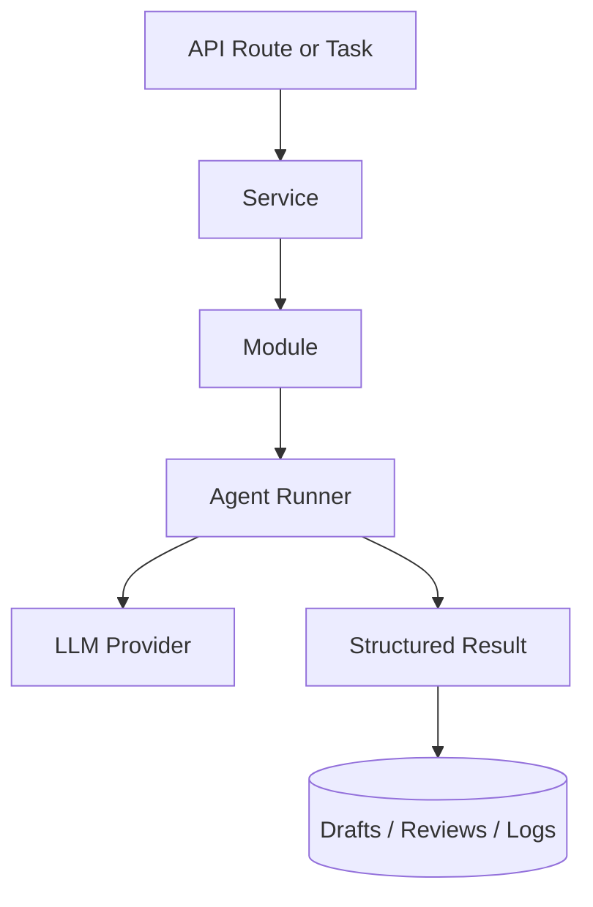
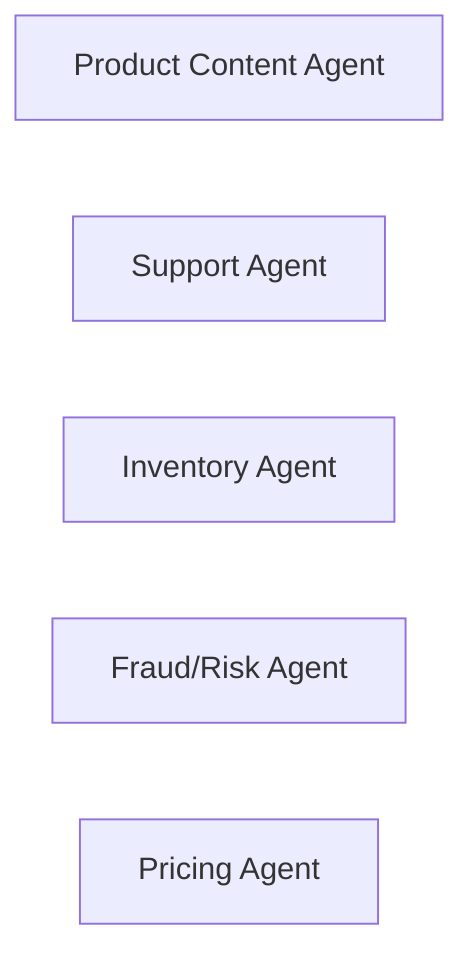
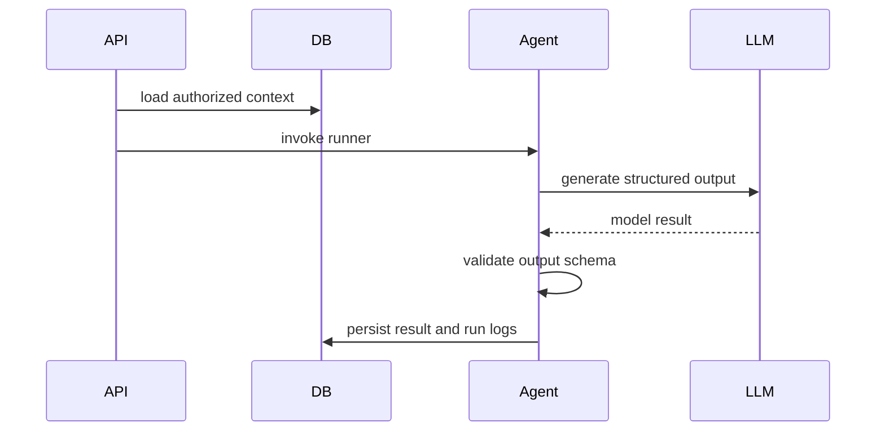
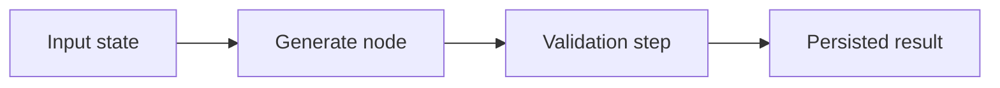
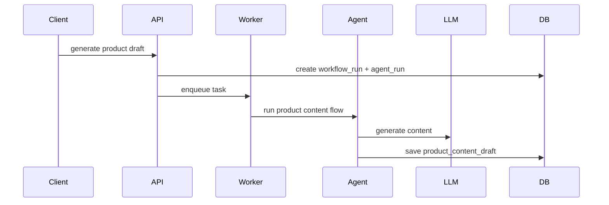
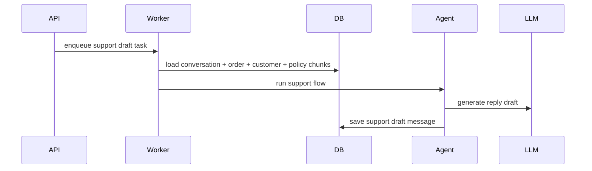
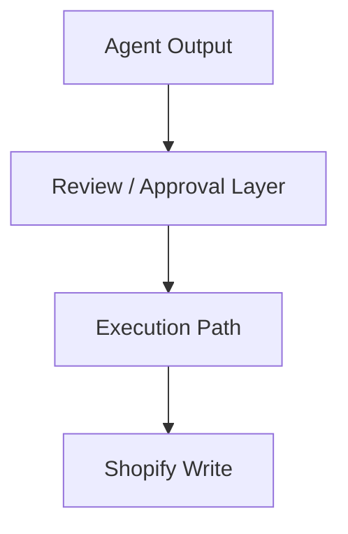

# CommerceOps AI - Agents Layer

The agents layer is the AI execution layer inside the backend. It produces drafts, recommendations, and explanations, then hands results back to the normal workflow and review system.

## Agent Layer Context

- Agents sit inside backend workflows, not outside them.
- They produce structured outputs rather than directly mutating Shopify.

## Current And Planned Agents

| Agent | Phase | Purpose | Main Output |
|---|---|---|---|
| `Product Content Agent` | `P0` | generate product content drafts | draft title, description, tags, SEO |
| `Support Agent` | `P1` | generate policy-grounded support drafts | reply draft, confidence, review flags |
| `Inventory Agent` | `P1` direction | support operational inventory reasoning | recommendation support |
| `Fraud/Risk Agent` | `P1` direction | explain risk signals | review context or explanation |
| `Pricing Agent` | `P2` | produce pricing recommendations | simulation or recommendation |

## Agent Execution Pattern

- The API or worker prepares the context first.
- The agent returns typed output that can be stored safely.

## LangGraph Pattern In This Repo

- Current LangGraph usage is intentionally lightweight.
- Most flows are controlled generation pipelines, not large autonomous graphs yet.

## Product Content Agent Flow

- This is the current P0 production path.

## Support Agent Flow

- Support drafts are grounded with policy and commerce context.
- Low-confidence results are flagged for review.

## Agent Safety Boundaries

- Agents do not publish directly to Shopify.
- Risky actions stay behind review or approval gates.
- Workflow and agent runs provide traceability for every important execution.

## Inputs And Outputs

| Input Type | Examples |
|---|---|
| Commerce context | products, variants, orders, customers |
| Policy context | policy documents and chunks |
| Operator context | requested tone, target fields, instructions |
| Workflow context | store id, user id, conversation id, product id |

| Output Type | Examples |
|---|---|
| Drafts | product content draft, support reply draft |
| Review signals | confidence score, needs review, rationale |
| Operational reasoning | risk explanation, reorder rationale |
