# CommerceOps AI - API Design

The API is organized around operator workflows. Some endpoints complete immediately, while generation, sync, and execution endpoints queue background work and return `202 Accepted`.

## API Surface Context

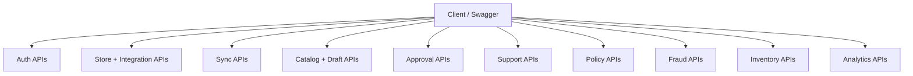

## Request Execution Model

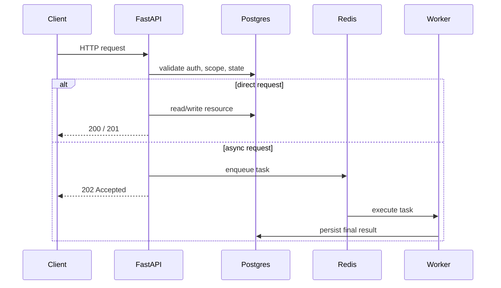

- Reads and small writes are synchronous.
- Sync, AI generation, and publish execution are asynchronous.

## Route Groups

| Group | Main Purpose | Typical Mode |
|---|---|---|
| `auth` | login, logout, current user, session refresh | sync |
| `stores` | store records and Shopify install flow | sync |
| `sync-runs` | start sync, retry sync, inspect sync history | async trigger + sync reads |
| `products` | product reads and content draft workflows | mixed |
| `approvals` | review and execute publish-governed actions | mixed |
| `support` | conversations, messages, reply drafts | mixed |
| `policies` | policy CRUD and retrieval source material | mixed |
| `fraud` | order risk score and review queue | sync-triggered agent writes + sync reads |
| `inventory` | alerts, reorder suggestions, supplier drafts | sync-triggered agent writes + sync reads |
| `pricing` | pricing rules, simulations, and recommendations | mixed |
| `analytics` | overview and automation metrics | sync |

## Auth API Flow

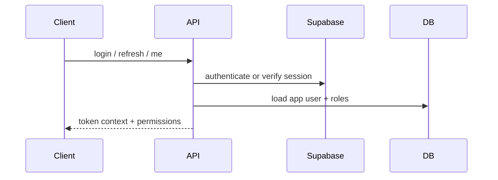

- Auth is backed by Supabase Auth.
- App roles and store scope come from the app database.

## Store And Shopify Connect Flow

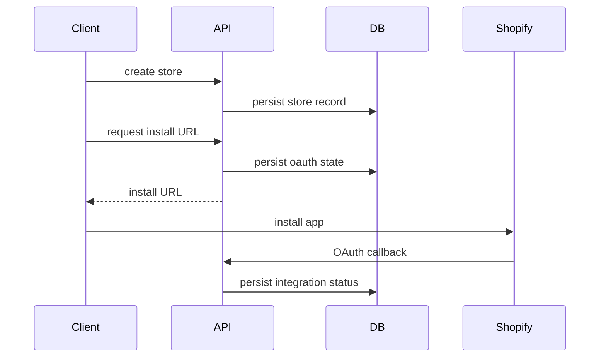

- Store creation and Shopify connection are separate steps.
- The callback finishes the connection state in the backend.

## Sync API Flow

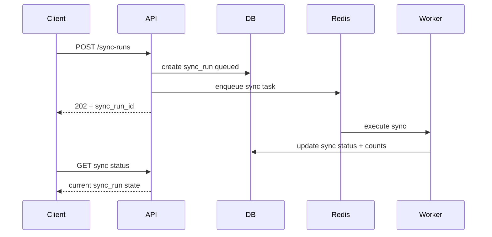

- Sync APIs are command + polling style.

## Product Draft API Flow

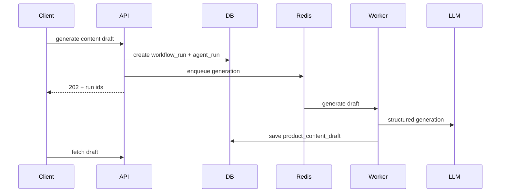

- Draft generation is asynchronous.
- Draft review and edit happen before approval submission.

## Approval And Publish API Flow

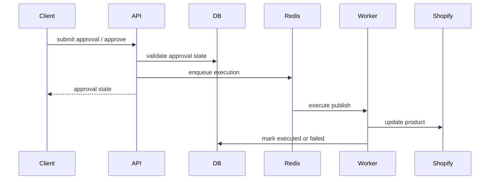

- Approvals protect risky store writes.
- Execution runs separately from human review.

## Support And Policy API Flow

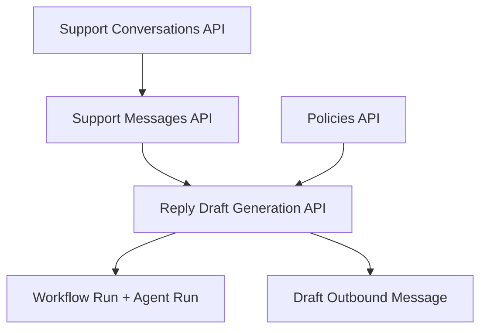

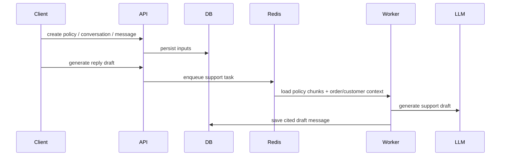

- Policies act as retrieval source documents.
- Support drafts stay internal and can be flagged for review.

## Fraud API Flow

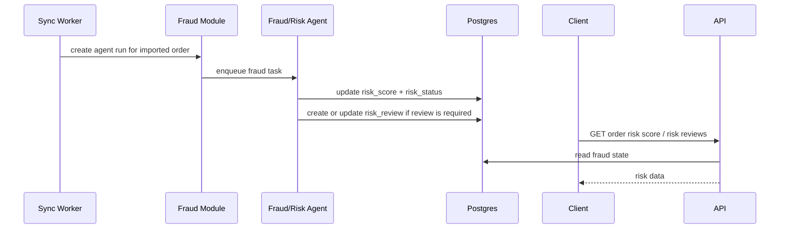

- Fraud assessment is triggered by sync, not by a standalone generation endpoint.
- Review APIs expose stored score, explanation, review metadata, and `agent_run_id`.

## Inventory API Flow

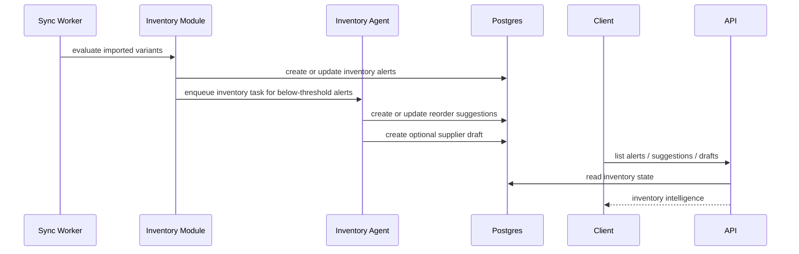

- Inventory APIs mainly expose worker-produced operational state.
- Suggestion responses include surfaced rationale, review metadata, and `agent_run_id`.

## Pricing API Flow

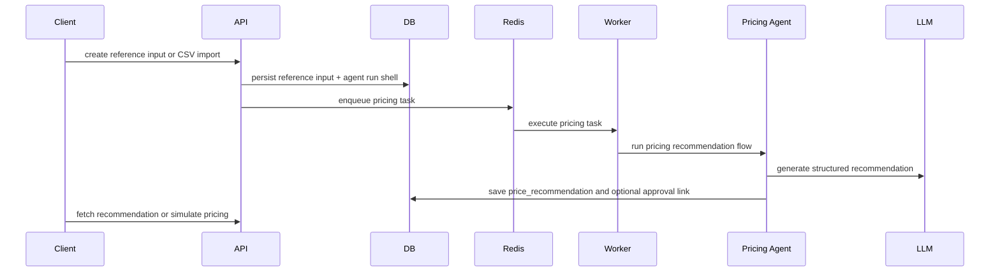

- Pricing simulation and recommendation responses are agent-backed.
- Business guardrails still block below-floor, above-ceiling, or unsafe recommendation outputs.

## Analytics API Flow

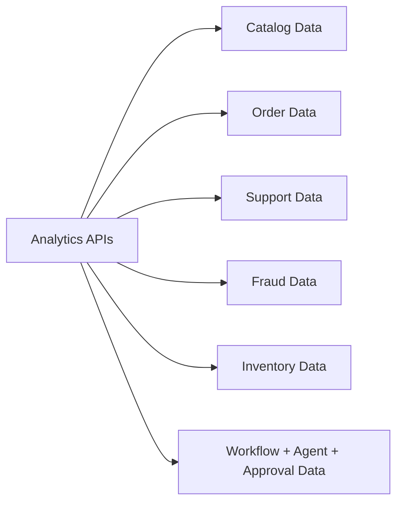

- Analytics are read-only aggregate endpoints.
- They summarize live application state rather than triggering new workflows.
