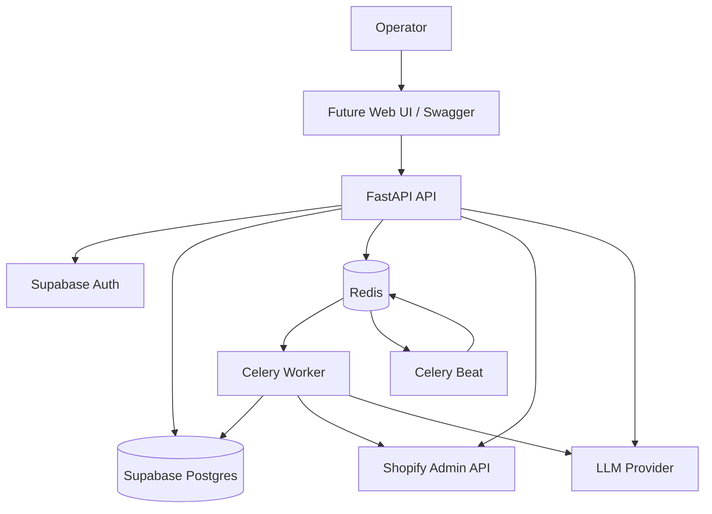
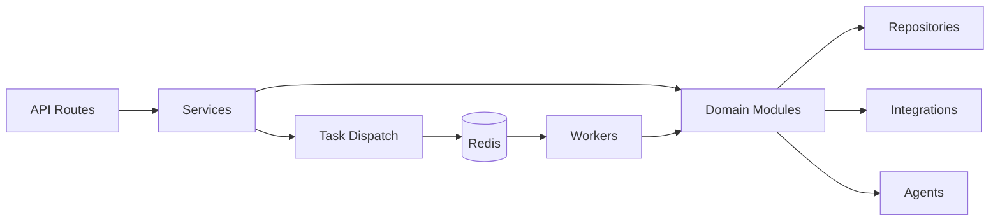
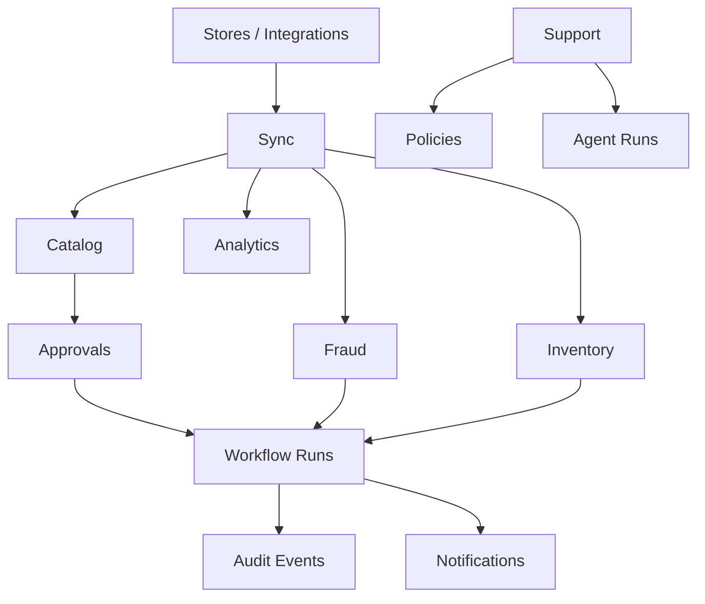
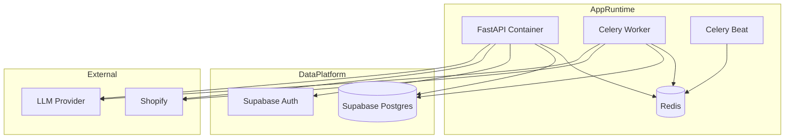
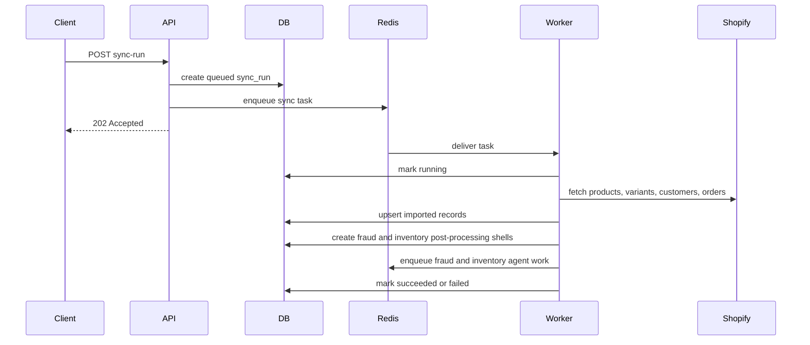
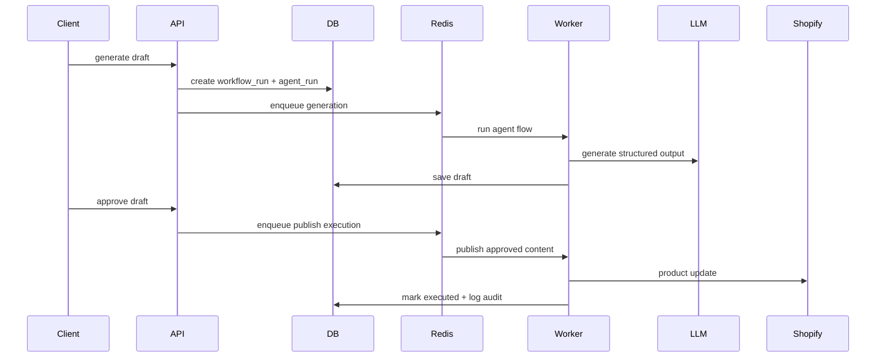
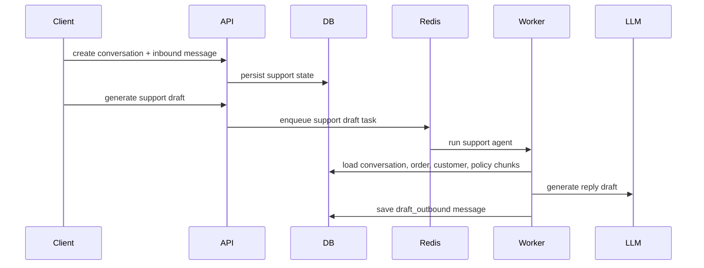
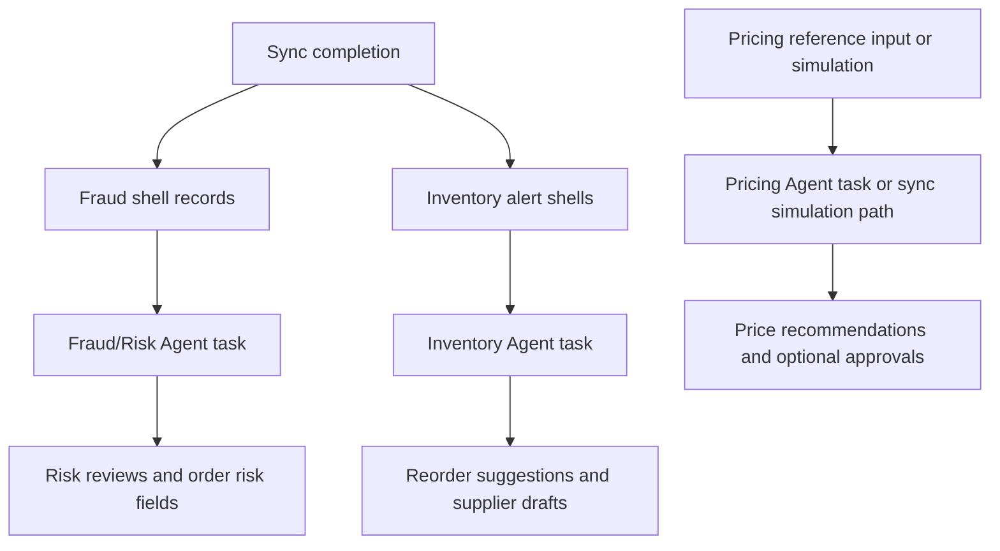

# CommerceOps AI - Architecture

CommerceOps AI is a backend-first Shopify operations system. The platform combines a FastAPI API, Celery workers, Shopify sync, internal workflow state, and AI-assisted drafting under a controlled approval model.

## System Context

- FastAPI is the main application boundary.
- Postgres stores internal state, logs, drafts, reviews, and approvals.
- Shopify remains the source of truth for commerce data.
- Celery handles long-running sync, generation, and execution work.

## Backend Internal Architecture

- Routes stay thin.
- Modules hold business rules.
- Workers reuse the same service and module logic instead of duplicating behavior.

## Domain Map

- P0 centers on sync, catalog drafts, approvals, and publish-back.
- P1 adds support, policy retrieval, fraud review, inventory alerts, and analytics.
- P1 and P2 also now use dedicated agent runners for fraud/risk, inventory reorder reasoning, and pricing recommendation flows.

## Runtime Deployment View

- Docker Compose runs the app services.
- Supabase is external in local development.

## Sync And Data Refresh Flow

- Sync is asynchronous.
- Fraud and inventory logic run after import, not before it.
- Those domains now hand off to dedicated agent tasks after sync shell records are persisted.

## Draft And Approval Flow

- AI generation and store execution are separate phases.
- Approval remains the safety boundary for Shopify writes.

## Support And Policy Flow

- Support drafts stay internal.
- Policy chunks and order context ground the generated reply.

## Operational Agent Flows

- Inventory, fraud/risk, and pricing now follow the same persisted `workflow_run` + `agent_run` model as the earlier product-content and support agents.
- Deterministic validation still runs after the agent output before final business records are updated.
