# Manual Testing Guide

This document captures the major manual backend validation flows that were exercised locally on `2026-06-12` against the real application stack.

## Test Environment

- API served locally at `http://localhost:8000`
- Swagger UI used for authenticated manual endpoint checks at `http://localhost:8000/docs`
- Celery `worker` and `beat` running with Redis
- Supabase Auth and Postgres configured through `infra/env/.env`
- Shopify app callback pointed to the active public tunnel during OAuth testing

## Test Setup

Start the local backend stack:

```powershell
docker compose up -d redis api worker beat
```

Important prerequisites before manual QA:

- latest database migrations must be applied
- Shopify app URL and redirect URL must use the active public tunnel
- Swagger access token must be refreshed if it expires during testing

## Coverage Summary

The following areas were manually exercised:

- organization and store setup
- Shopify connection and callback flow
- store sync queueing and retry flow
- product draft generation and approval
- policy and support conversation flows
- fraud review flows
- inventory alert and reorder flows
- analytics endpoints
- pricing rules, reference prices, and recommendations
- workflow creation and dry-run testing

## 1. Organization And Store Setup

Validated:

- authenticated access to protected endpoints through Swagger
- organization-dependent flows after account setup
- store creation with platform metadata
- Shopify install URL generation
- Shopify callback completion and connected integration status

Screenshots:

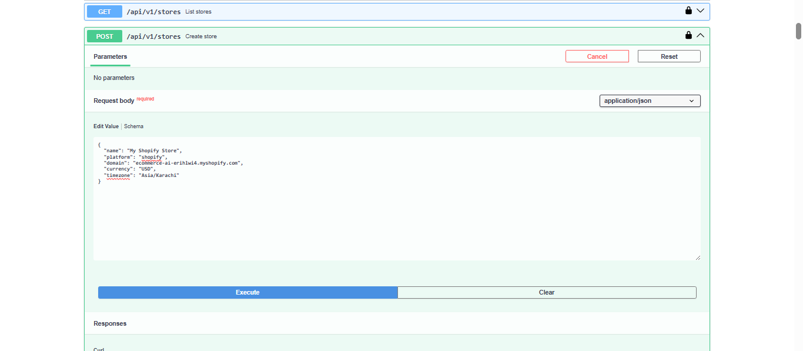

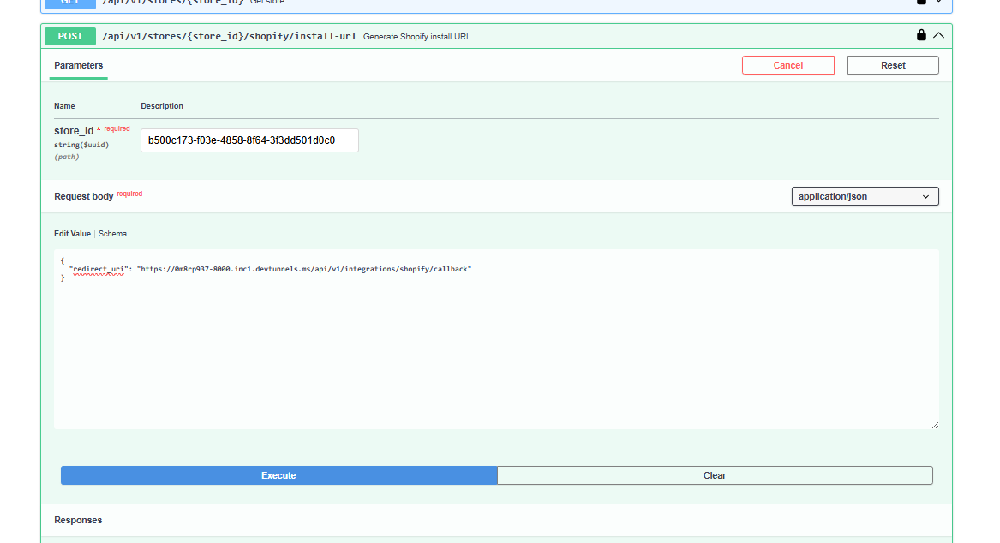

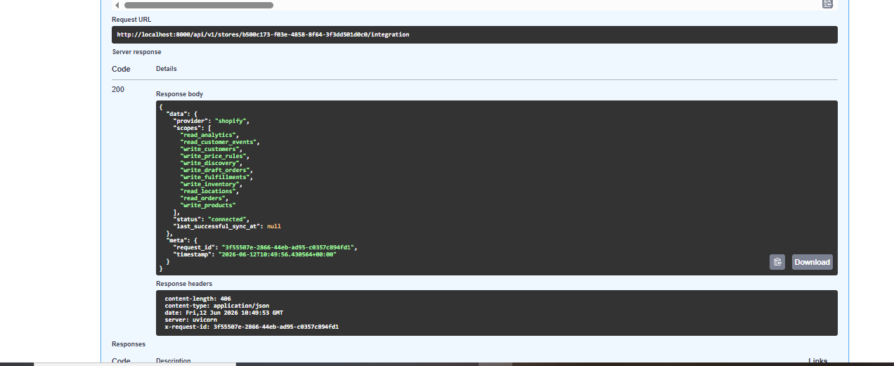

## 2. Sync And Ingestion

Validated:

- manual sync run queueing through `POST /api/v1/stores/{store_id}/sync-runs`
- queued sync inspection through sync-run detail endpoints
- retry flow for a failed sync run
- successful import of products, variants, customers, orders, fraud jobs, and inventory jobs

The successful retry showed imported entities and downstream queueing such as:

- products and variants imported
- fraud risk assessments queued
- inventory alerts created
- reorder suggestions queued

Screenshots:

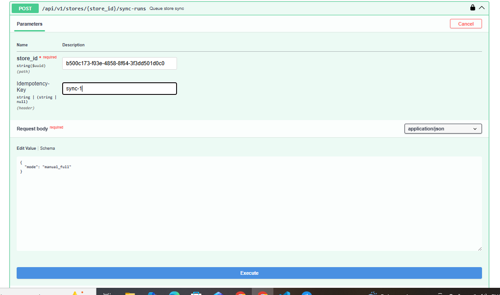

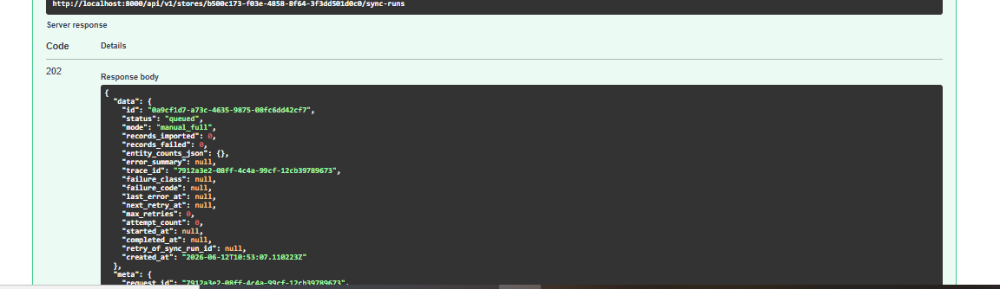

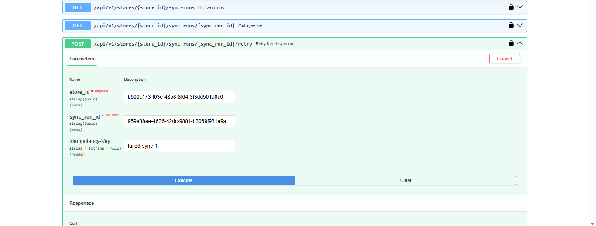

## 3. Product Content Drafting And Approval

Validated:

- queueing a product content draft generation job
- listing generated drafts for a product
- retrieving the generated draft content
- submitting a draft for approval
- approving the draft and queueing execution
- verifying the publish-back flow against Shopify

Screenshots:

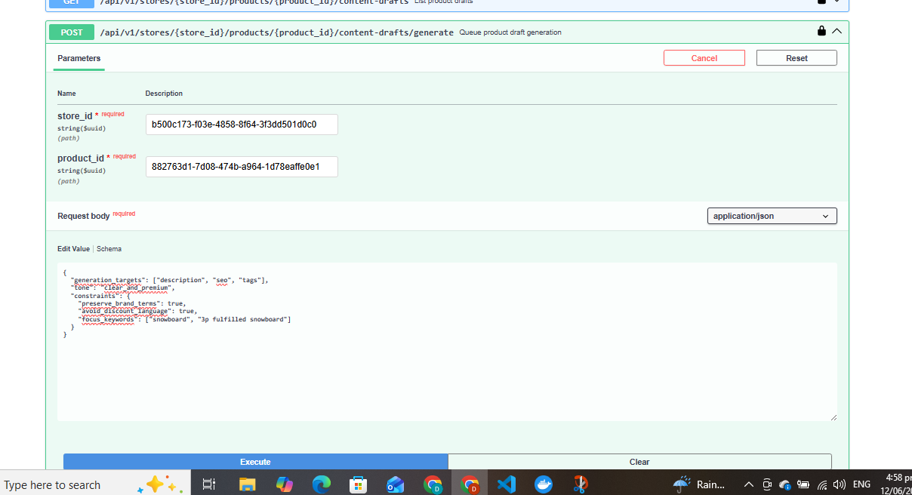

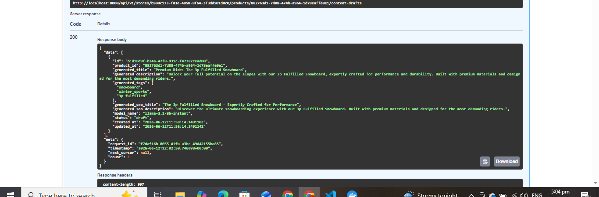

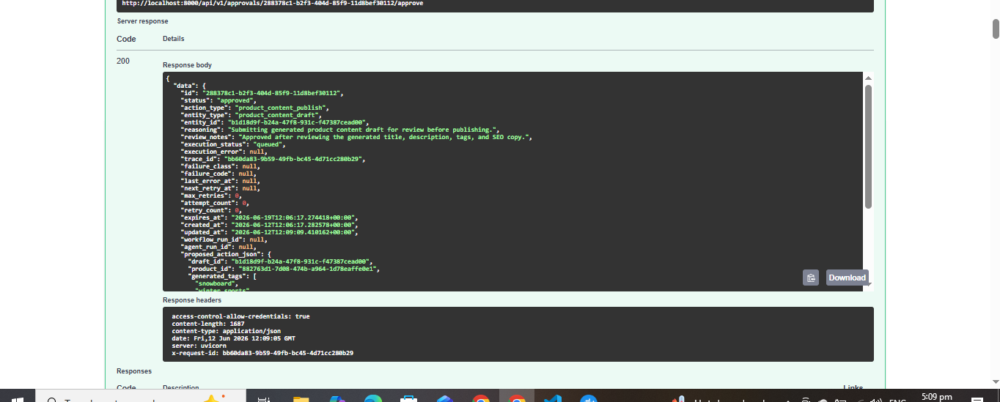

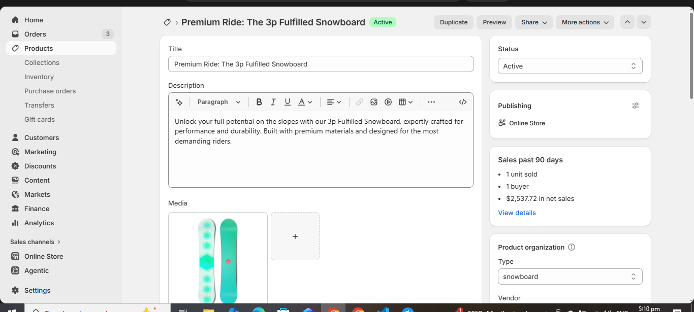

## 4. Policies And Support

Validated:

- policy document creation
- support conversation creation with linked customer and order context
- support message creation
- support reply draft generation from conversation and policy context

Notes:

- support drafts are generated for operator review and are not auto-sent to the customer
- conversation creation worked once valid `customer_id` and `order_id` values from synced data were used

Screenshots:

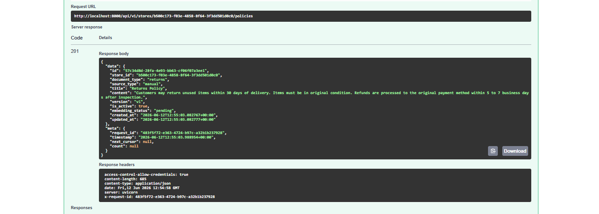

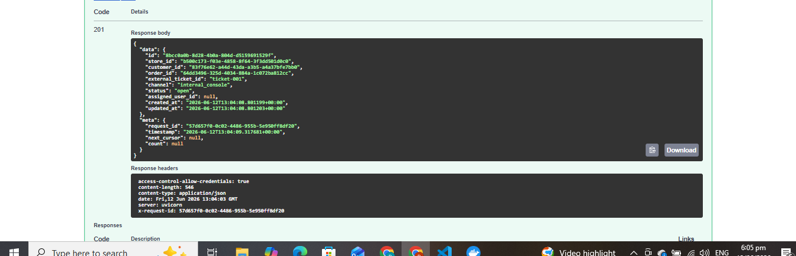

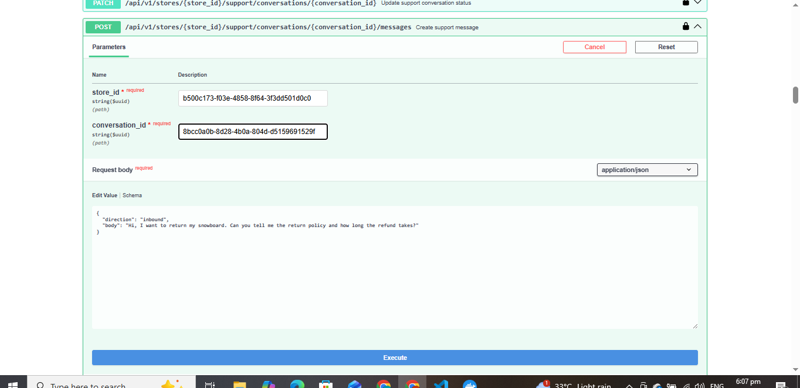

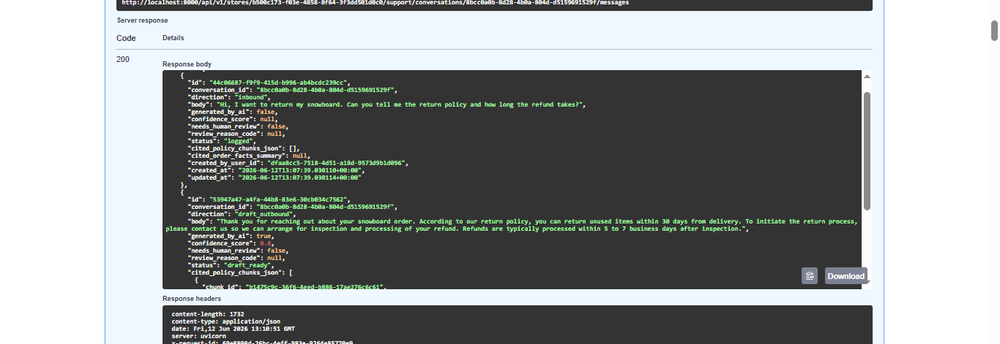

## 5. Fraud Review

Validated:

- order risk-score lookup
- fraud review record generation from synced orders
- manual review decision recording with operator notes

Observed behavior:

- imported orders were scored and marked for review when customer billing and shipping information was incomplete
- review records moved from pending review to reviewed state after a decision was recorded

Screenshots:

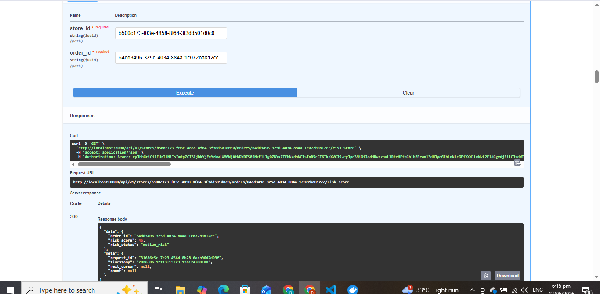

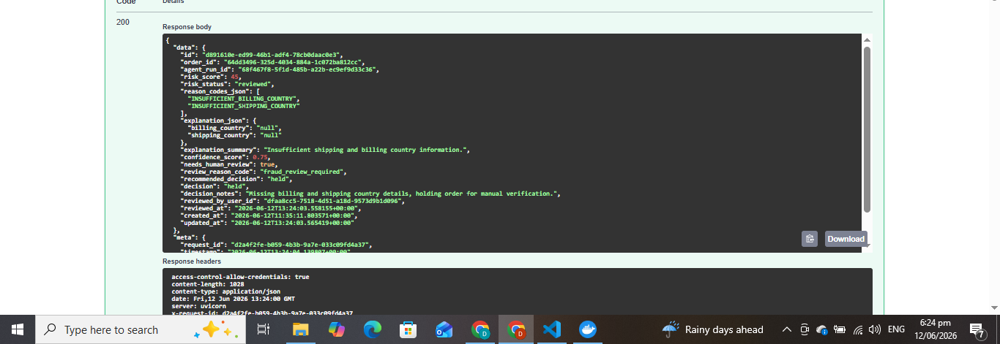

## 6. Inventory Operations

Validated:

- inventory alerts created during sync for low-stock conditions
- reorder suggestions generated from alert data
- supplier reorder draft creation from a reorder suggestion

Observed behavior:

- inventory outputs were successfully generated after tightening agent output handling during QA
- reorder suggestions remained reviewable before any supplier communication step

## 7. Analytics

Validated:

- analytics overview endpoint
- automation analytics endpoint after local fix
- runtime-oriented metrics such as retries, queueing, and agent activity

Screenshot:

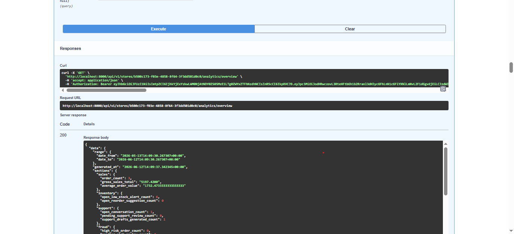

## 8. Pricing

Validated:

- pricing rule creation and retrieval
- manual reference-price creation
- pricing recommendation generation and inspection
- recommendation review data including safe-to-execute and approval-related fields

Observed behavior:

- pricing recommendations are advisory and remain operator-controlled
- the flow surfaces strategy inputs, validation results, and recommendation reasoning

Screenshots:

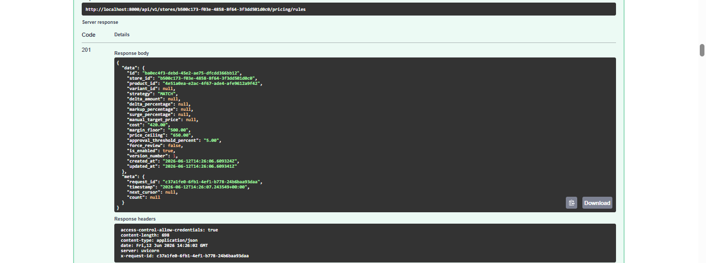

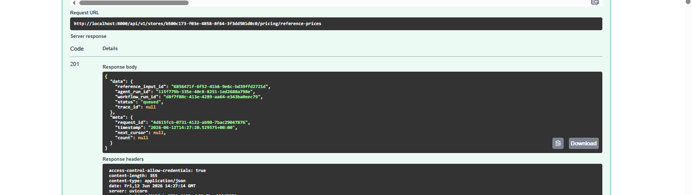

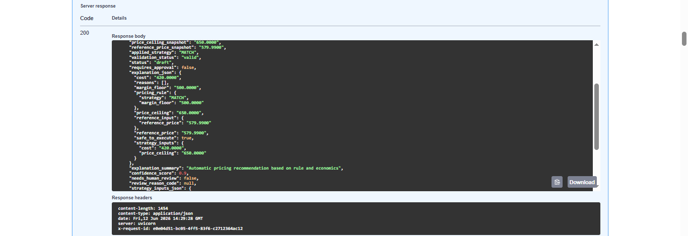

## 9. Workflows

Validated:

- workflow creation
- workflow listing and retrieval
- workflow dry-run testing
- matched and non-matched execution behavior in test mode

Observed behavior:

- dry-run workflow tests returned whether a rule matched
- returned action plans were descriptive and safe because they did not execute live side effects

Screenshots:

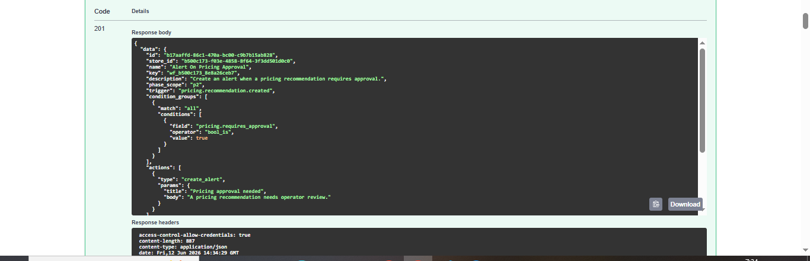

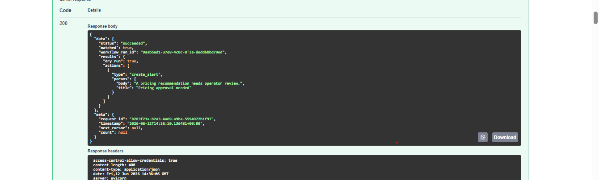

## Issues Found During QA

The manual pass surfaced a few real issues that were then corrected locally:

- missing support for new `agent_type` values caused the first inventory/fraud follow-on sync flow to fail until the local schema was updated
- inventory agent output needed stronger normalization and prompt constraints to keep draft generation stable
- the analytics automation endpoint returned `500` until metric mapping was corrected
- Swagger requests began failing with Supabase JWT errors after token expiry; re-authentication resolved that during testing

## Overall Assessment

Manual testing shows the backend is functionally strong across the main operator flows:

- Shopify connection works
- sync and downstream operational jobs work
- product drafting and approvals work
- support, fraud, inventory, analytics, pricing, and workflow endpoints are all reachable and testable

Current confidence is highest for local development and supervised operator workflows. The main areas still better treated as follow-up validation are:

- long-running scheduled behavior through `beat`
- external delivery channels under production-like conditions
- broader deployment hardening outside the local stack
