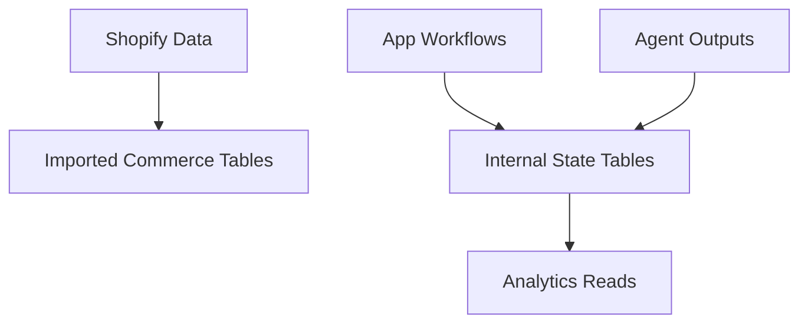
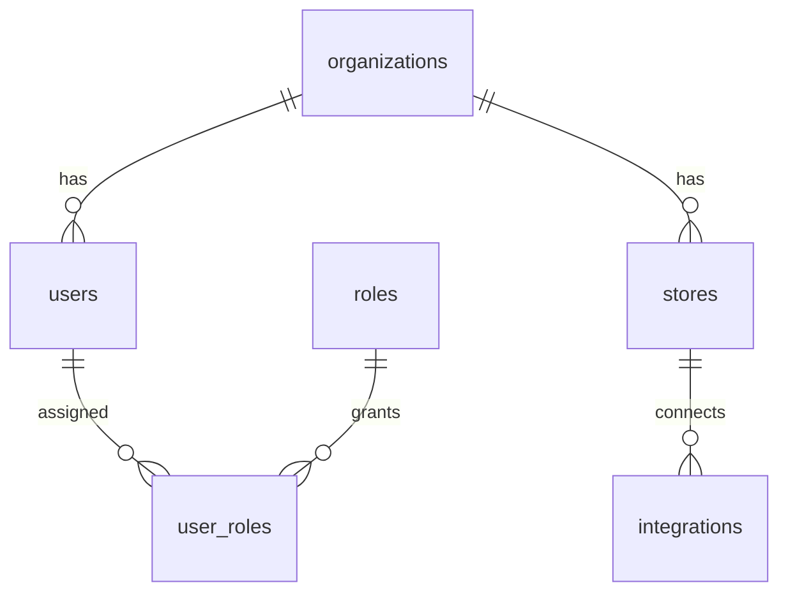
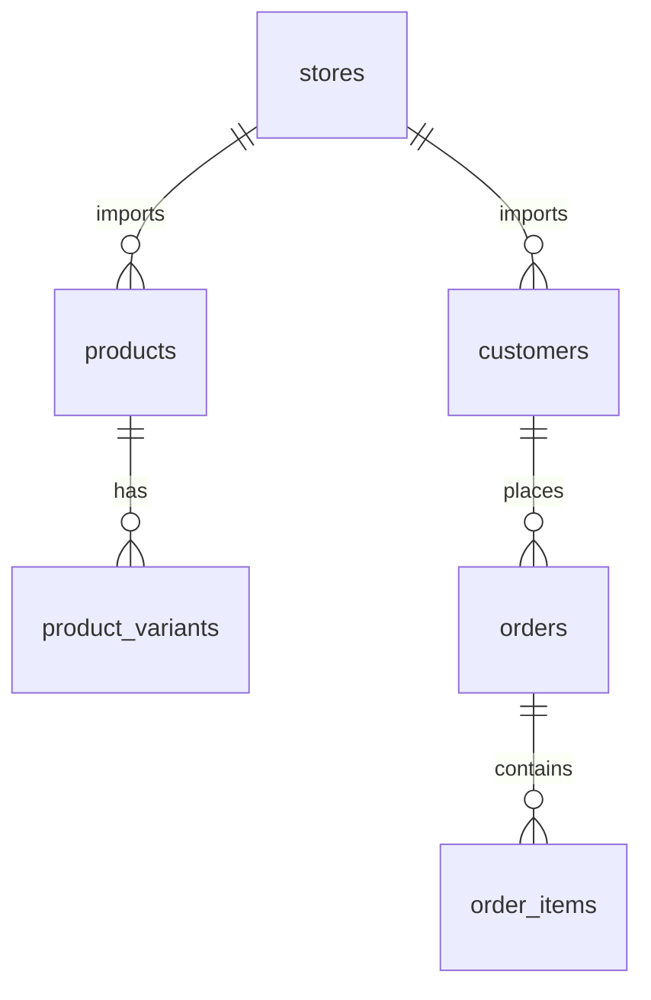
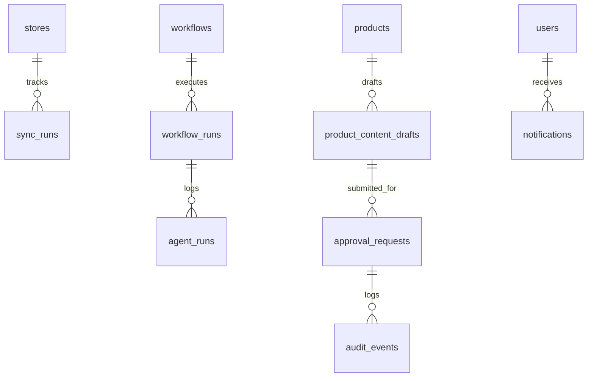
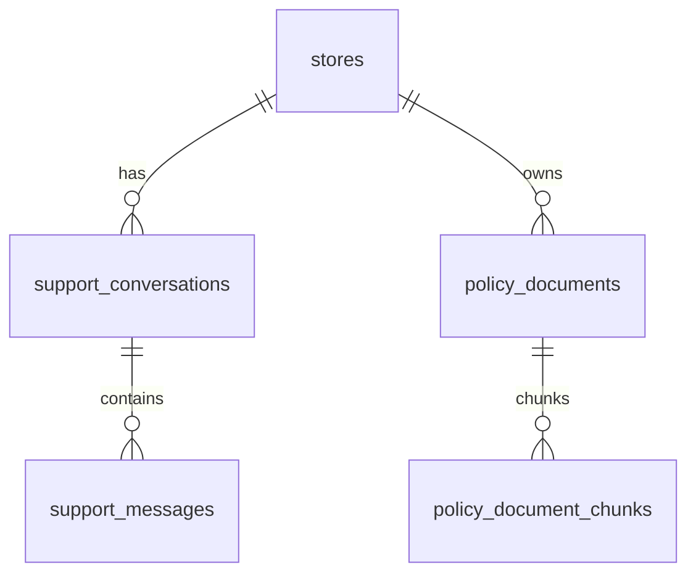
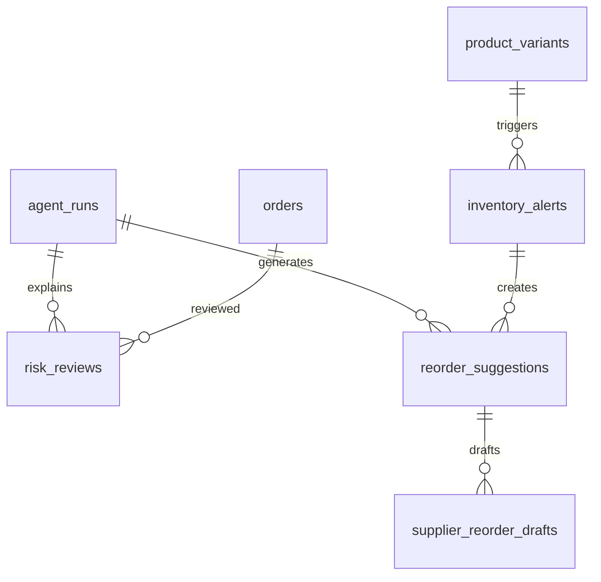
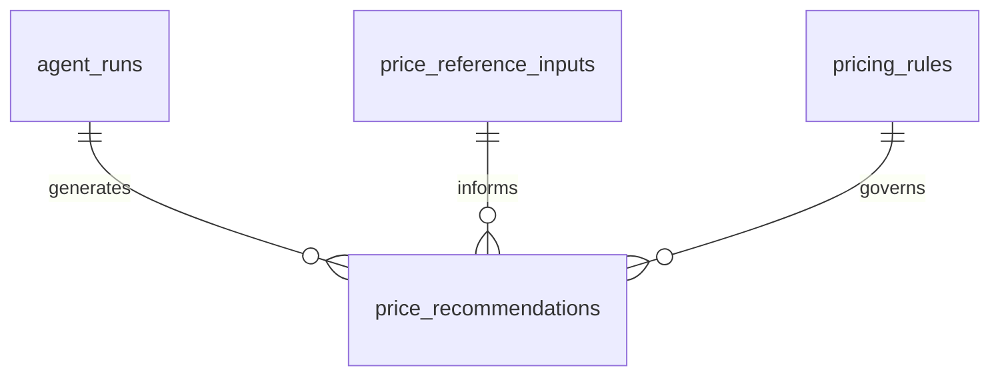
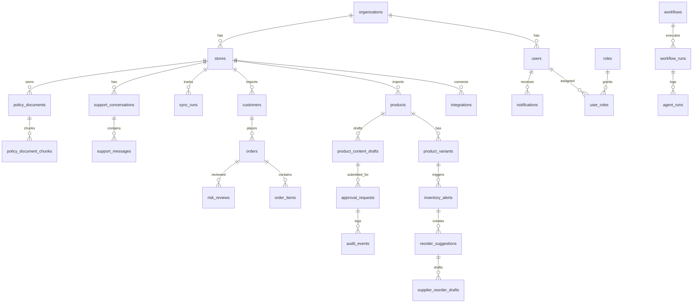

# CommerceOps AI - Schema Design

The schema combines imported Shopify records with internal workflow, draft, approval, and review entities.

## Data Model Context

- Shopify is the external commerce source.
- Internal tables store workflow and operator state.

## Scope And Identity

- `organization` is the business root.
- `store` scopes imported commerce data and operational workflows.

## Commerce Import Model

- Products, customers, and orders are synced snapshots.
- These tables feed catalog, support, fraud, inventory, and analytics flows.

## Workflow And Execution Model

- `sync_runs` track import jobs.
- `workflow_runs` and `agent_runs` track async system activity.
- `approval_requests` protect execution-governed actions.

## Support And Policy Model

- Support messages hold inbound text and draft replies.
- Policy chunks are the retrieval layer for grounded support generation.

## Fraud And Inventory Model

- Fraud uses stored order risk plus agent-linked review records.
- Inventory uses alerts, agent-linked suggestions, and supplier drafts as operator artifacts.

## Pricing Recommendation Model

- Pricing recommendations remain business records, but now carry surfaced agent rationale and review metadata.
- `agent_run_id` links operational records back to runtime traces rather than duplicating full runtime state in business tables.

## Full Core ERD

## Table Families

| Family | Main Tables |
|---|---|
| Scope and access | `organizations`, `users`, `roles`, `user_roles`, `stores`, `integrations` |
| Commerce import | `products`, `product_variants`, `customers`, `orders`, `order_items` |
| Workflow state | `sync_runs`, `workflows`, `workflow_runs`, `agent_runs` |
| Catalog publish flow | `product_content_drafts`, `approval_requests`, `audit_events`, `notifications` |
| P1 support | `support_conversations`, `support_messages`, `policy_documents`, `policy_document_chunks` |
| P1 operations | `risk_reviews`, `inventory_alerts`, `reorder_suggestions`, `supplier_reorder_drafts` |
| P2 pricing operations | `pricing_rules`, `price_reference_inputs`, `price_recommendations` |

## Agent-Linked Business Fields

The operational business tables now surface selected agent-derived fields directly for API and UI use:

- `reorder_suggestions`
  - `agent_run_id`
  - `rationale_summary`
  - `urgency`
  - `confidence_score`
  - `needs_human_review`
  - `review_reason_code`
- `risk_reviews`
  - `agent_run_id`
  - `explanation_json`
  - `explanation_summary`
  - `confidence_score`
  - `needs_human_review`
  - `review_reason_code`
  - `recommended_decision`
- `price_recommendations`
  - `agent_run_id`
  - `explanation_summary`
  - `confidence_score`
  - `needs_human_review`
  - `review_reason_code`
